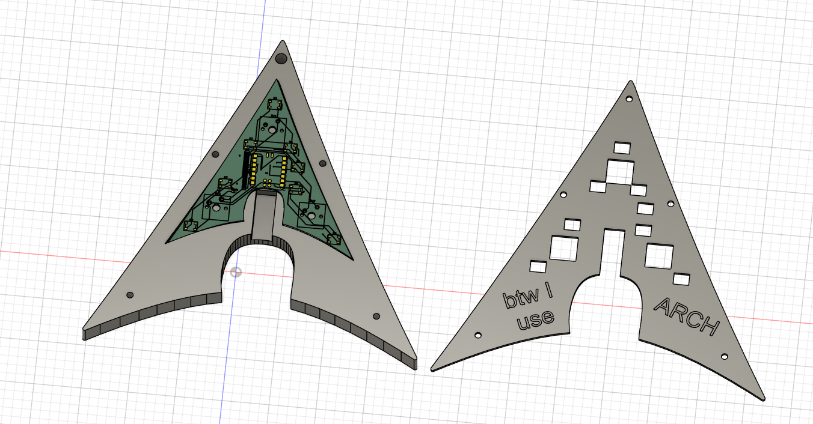
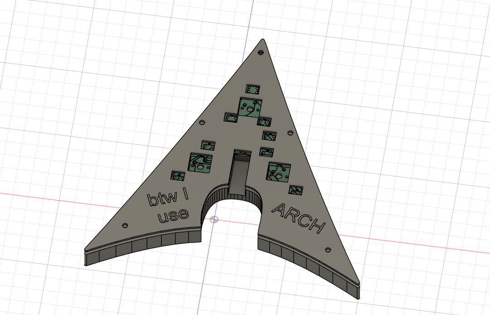
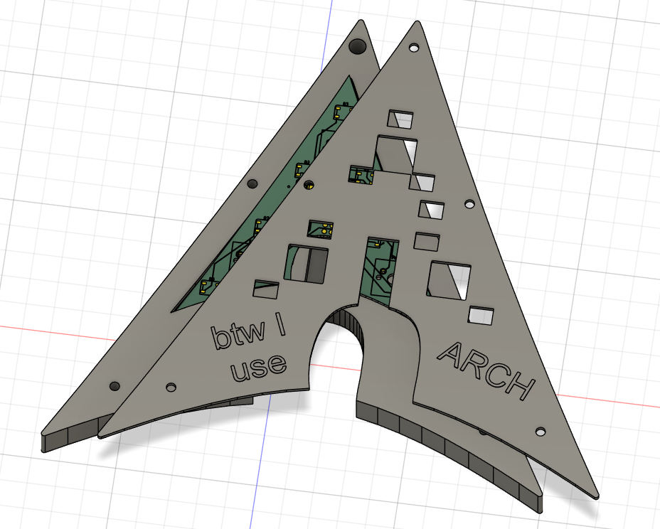
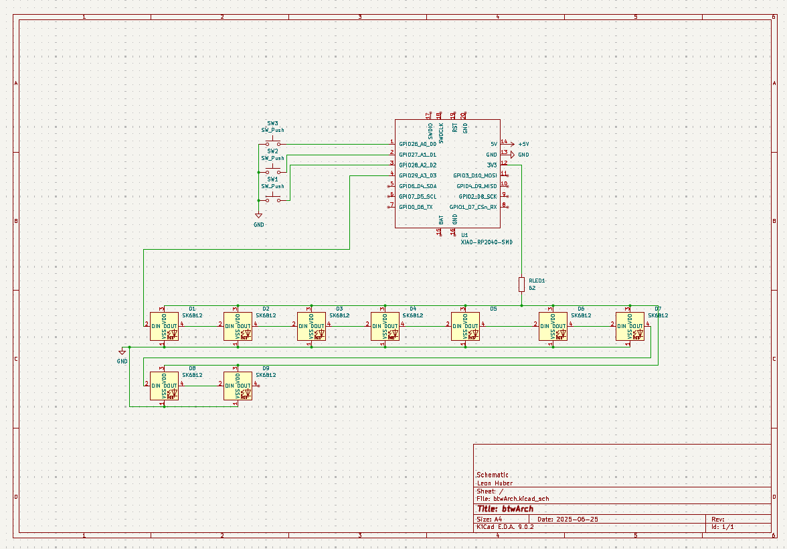
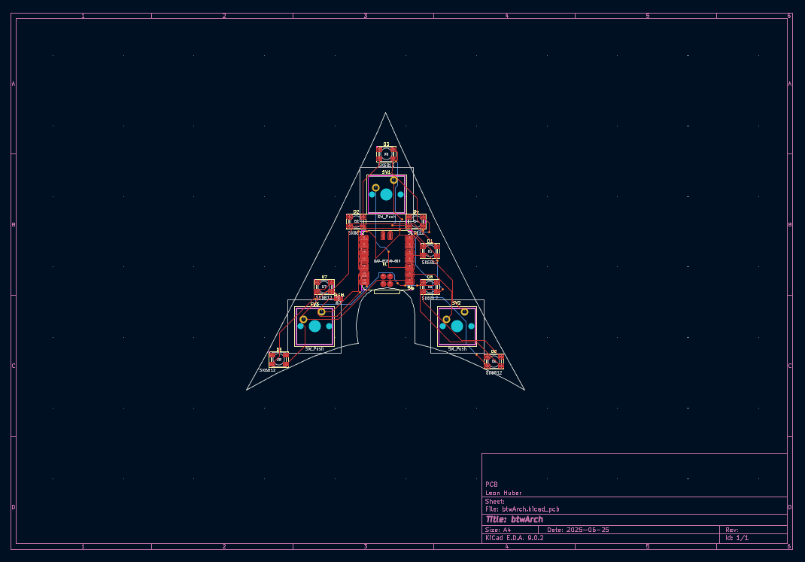

**Autor:** Leon Huber [leonerwinhube@gmail.com](mailto:leonerwinhube@gmail.com)  
**Datum:** 2025-04-29  

---
# btwArch

btwArch is a custom mechanical macropad designed because I use Arch btw. This hackpad features a sleek design with customizable keys, RGB lighting, and modern connectivity options to enhance your workflow.

Built as part of the HackClub 2025 initiative, this project serves as both a functional tool and a learning experience in PCB design, 3D modeling, and firmware development.    
(It was my first HackClub <3)

## Overall Design:
Here's the complete assembled btwArch showing the final product in action:

*The finished btwArch ready for daily use*

## CAD Model & Case Design:
The case features a modern, minimalist design with precise tolerances for perfect component fit. The assembly uses standard hardware for easy manufacturing and repair.

*3D model showing how all components fit together from different angles*

## PCB Design
The PCB was designed with modern best practices, featuring proper ground planes, optimized routing, and robust component placement.

**Schematic:**

*Complete electrical schematic showing all connections*

**PCB Layout:**

*Final PCB layout with optimized routing and component placement*

## Firmware Overview
btwArch runs on KMK firmware, a powerful and flexible keyboard firmware that allows for extensive customization and macro programming.

**Features:**
- Customizable key macros via KMK
- RGB lighting effects and patterns

## Bill of Materials (BOM):

| Component | Quantity | Specification |
|-----------|----------|---------------|
| Mechanical Switches | 3x | Cherry MX Switches |
| Keycaps | 3x | Blank DSA keycaps (White) |
| RGB LEDs | 8x | SK6812 MINI-E LEDs |
| Microcontroller | 1x | Seeed XIAO RP2040-SMD |
| Resistors | 1 | 63 ohm |
| Case | 1 | 2 printed parts |